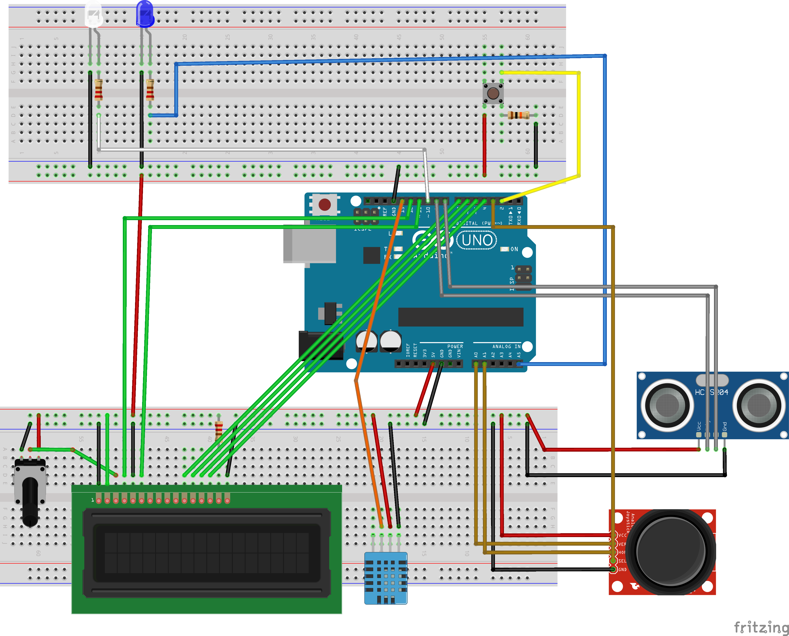

# VendingMachine

# PRACTICA 3: MAQUINA EXPENDEDORA

 Irene Diez de Toro
 
 Noviembre - Diciembre 2024 - Third Year of Robotic Software Robotics Engineering

 Sistemas Empotrados y de Tiempo Real.

# 0. INTRODUCTION

El objetivo general de esta práctica ha sido diseñar e implementar un controlador para una máquina expendedora basada en Arduino UNO, utilizando sensores y actuadores del kit. Debe cumplir funcionalidades específicas relacionadas con interacción usuario-máquina, sensores, actuadores y un sistema de administración.
Este programa se dividia en tres funcionalidades principales:
- ARRANQUE: En este caso se debía de encender una luz y parpadear tres veces, mientras en pantalla se mostraba en el display "CARGANDO".
- SERVICIO: En este segundo caso se debia de comprobar si habia un cliente delante de la máquina, mostrar la temperatura si ese era el caso y pasar al menú de bebidas. Donde se podía ver cuales habia. Tambien se permitia la seleccion de cualquiera, donde para simular la preparación, se encendía un led de manera incremental, mientras se mostraban los correspondientes mensajes en la pantalla.
- ADMINISTRADOR: A este se accedia mediante el accionado de un boton durante 5 segundos. Una vez dentro se encendian los leds durante toda su ejecución. En este se mostraba en el display el menu de opciones. Donde se podia ver la temperatura, la distancia del sensor de distancia, el contador (donde se mostraba el tiempo que llevaba la placa encendida) y por ultimo se podian modificar los precios. En este ultimo, se motraba otra vez el menu de bebidas, y una vez seleccionada una, se podia incrementar o decrementar los precios. Actualizandose cuando se volvieran a mostrar. Se salia de la misma forma que para entrar en el modo.

# 1. MI PROGRAMA

My algorithm is designed to allow the robotic vacuum cleaner to move efficiently, using a navigation strategy based on wall bouncing. The goal of this technique is to maximize the coverage of the area while avoiding obstacles, ensuring that the vacuum cleaner explores the largest possible space available. The state machine used is:

The algorithm begins in an initial state called SPIRAL, where the vacuum cleaner moves in a spiral pattern. This movement not only allows the vacuum to advance and clean the area effectively, but also gradually increases its speed, optimizing cleaning time. As the vacuum moves forward, the bumper is used to detect any obstacles that may interrupt its path.

When the sensor detects a collision, the algorithm transitions to the TURN state. In this state, the vacuum cleaner stops and prepares to turn in a random direction, thus avoiding the obstacle that caused the collision. This random turn is implemented using a timer that determines the duration and angle of the turn, allowing for more dynamic maneuvering in tight spaces.

Once the vacuum has completed its turn, the algorithm switches to the FORWARD state, where the vacuum moves forward again in a straight line. This combination of states ensures that the vacuum not only avoids obstacles but also continues cleaning efficiently. The state transitions occur smoothly, enabling the robot to quickly react to the changing conditions in its environment.

# 3. FRIZTING

A continuacion, se muestra la imagen del esquema del circuito. 

  
  &nbsp;&nbsp;&nbsp;

Y la foto del circuito real:

  
  &nbsp;&nbsp;&nbsp;
  
  &nbsp;&nbsp;&nbsp;

# 4. DIFICULTADES

Durante la realización de esta práctica, he tenido una serie de problemas que explicaré a continuación:

- *Adaptarme a Arduino y a sus componentes* fue un desafío al principio. Tuve algunas dificultades iniciales con el conexionado, ya que en mi kit tanto el display como el sensor de temperatura estaban dañados. Esto complicó un poco los primeros pasos. Sin embargo, una vez solucionado ese inconveniente, logré entender cómo se conectaban los componentes, cómo interactuaban con Arduino, y también me familiaricé con sus librerías y con el entorno de desarrollo (IDE).
- Me costó muchísimo entender cómo *contar el tiempo necesario* para las distintas funcionalidades. Al principio, lo intenté utilizando bucles while, pero rápidamente me di cuenta de que estaba utilizando espera activa, lo que bloqueaba el flujo del programa principal. Esto causaba problemas, especialmente con tareas como las interrupciones, que se veían bloqueadas. Después de una tutoría y de darle muchas vueltas al problema, logré encontrar una solución utilizando estructuras if en lugar de bucles, lo que me permitió medir el tiempo sin bloquear el programa principal.
- Por último, implementar la *funcionalidad del botón de reinicio y administrador* fue un desafío. Al principio, no lograba que ambos botones funcionaran correctamente; a veces solo uno respondía y el otro no. Después de investigar y probar diferentes enfoques, conseguí identificar el problema y ajustar el código.

# 5. VIDEO OF THE VENDING MACHINE

Haz click en el link para verlo! -> [MAQUINA EXPENDEDORA]([https://urjc-my.sharepoint.com/:v:/g/personal/i_diezd_2022_alumnos_urjc_es/ER4M29brXlRDl2lvbxE1JsUB3x4IVXTgQU_WdYtsLEO2fA?e=sUdUaQ&nav=eyJyZWZlcnJhbEluZm8iOnsicmVmZXJyYWxBcHAiOiJTdHJlYW1XZWJBcHAiLCJyZWZlcnJhbFZpZXciOiJTaGFyZURpYWxvZy1MaW5rIiwicmVmZXJyYWxBcHBQbGF0Zm9ybSI6IldlYiIsInJlZmVycmFsTW9kZSI6InZpZXcifSwicGxheWJhY2tPcHRpb25zIjp7fX0%3D](https://urjc-my.sharepoint.com/:v:/g/personal/i_diezd_2022_alumnos_urjc_es/EepZyyvT2Y5CuTeeIXFXMX8BVGGi0csNQJd0kgF7qjUQKQ?nav=eyJyZWZlcnJhbEluZm8iOnsicmVmZXJyYWxBcHAiOiJTdHJlYW1XZWJBcHAiLCJyZWZlcnJhbFZpZXciOiJTaGFyZURpYWxvZy1MaW5rIiwicmVmZXJyYWxBcHBQbGF0Zm9ybSI6IldlYiIsInJlZmVycmFsTW9kZSI6InZpZXcifX0%3D&e=BXOjlE)) :)

Adicional, ya que no he enseñado en el otro si el sensor no me detecta: [MAQUINA EXPENDEDORA]([https://urjc-my.sharepoint.com/:v:/g/personal/i_diezd_2022_alumnos_urjc_es/ER4M29brXlRDl2lvbxE1JsUB3x4IVXTgQU_WdYtsLEO2fA?e=sUdUaQ&nav=eyJyZWZlcnJhbEluZm8iOnsicmVmZXJyYWxBcHAiOiJTdHJlYW1XZWJBcHAiLCJyZWZlcnJhbFZpZXciOiJTaGFyZURpYWxvZy1MaW5rIiwicmVmZXJyYWxBcHBQbGF0Zm9ybSI6IldlYiIsInJlZmVycmFsTW9kZSI6InZpZXcifSwicGxheWJhY2tPcHRpb25zIjp7fX0%3D](https://urjc-my.sharepoint.com/:v:/g/personal/i_diezd_2022_alumnos_urjc_es/EepZyyvT2Y5CuTeeIXFXMX8BVGGi0csNQJd0kgF7qjUQKQ?nav=eyJyZWZlcnJhbEluZm8iOnsicmVmZXJyYWxBcHAiOiJTdHJlYW1XZWJBcHAiLCJyZWZlcnJhbFZpZXciOiJTaGFyZURpYWxvZy1MaW5rIiwicmVmZXJyYWxBcHBQbGF0Zm9ybSI6IldlYiIsInJlZmVycmFsTW9kZSI6InZpZXcifX0%3D&e=BXOjlE)) 
